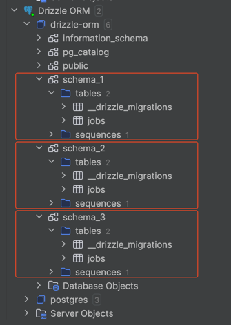

# Migrations

For all commands inside this README that contain the `<SET_ENV_VARS>` property, they should use:

```bash
env DB_USER="drizzle-orm" env DB_PASSWORD="pass" env DB_HOST_NAME="localhost" env DB_PORT="5432" env DB_NAME="drizzle-orm" env DB_SCHEMA_NAME="your-custom-schema-name" 
```

Remember to change the schema name (`DB_SCHEMA_NAME`) depending on your needs (as you should change any other property depending on your database setup).

---

## Generate new migration from the existing entities

```bash
<SET_ENV_VARS> drizzle-kit generate:pg   
```

## Run migrations against the database (using [migrate](https://orm.drizzle.team/kit-docs/overview#running-migrations))

```bash
<SET_ENV_VARS> npx tsx run_migrations.ts
```

---

## introspect (generate entities from existing database)

```bash
<SET_ENV_VARS> drizzle-kit introspect:pg
```
--- 

## Quick start

```bash
cd ../ && docker compose up -d && sleep 1 && env DB_USER="drizzle-orm" env DB_PASSWORD="pass" env DB_HOST_NAME="localhost" env DB_PORT="5432" env DB_NAME="drizzle-orm" env DB_SCHEMA_NAME="schema_1" npx tsx migrations/run_migrations.ts && echo "Database and schema were created. Use Drizzle Studio/Datagrip/DBeaver to view the DB"
```

Keep in mind that you should have the container `postgres:16.2-alpine` already downloaded by docker for this to actually work properly. Change `sleep 1` to a greater value if you don't or your network/machine is slow.

Let's say you run the previous command 3 times and only changed `DB_SCHEMA_NAME` on those 3 executions (`schema_1`, `schema_2`, `schema_3`), you'd expect (assuming that it run with success everytime) to have the following:


